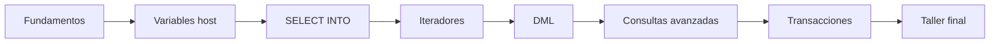

# SQLJ con Java 8

## Guía visual y práctica por entregas

Esta versión Markdown organiza el aprendizaje de SQLJ en ocho entregas progresivas. Todos los ejemplos utilizan el mismo modelo de datos y separan:

1. SQL convencional.
2. Integración mediante SQLJ.
3. Código Java relevante.
4. Resultado esperado.
5. Errores frecuentes.
6. Dependencias de implementación.

> **Advertencia técnica**
>
> SQLJ no es una característica general de Java 8. Requiere un traductor, un entorno de ejecución SQLJ y un controlador compatibles. La declaración y creación concreta del contexto, los perfiles SQL, algunas excepciones, la generación de claves y la comprobación de filas afectadas pueden variar entre Oracle, IBM Db2 y otras implementaciones.

## Convención visual

- **Azul**: Java, variables y componentes de aplicación.
- **Morado**: SQLJ, variables host, contextos e iteradores.
- **Verde**: SQL, resultados correctos y `COMMIT`.
- **Naranja**: base de datos, tablas y registros.
- **Rojo**: errores, excepciones y `ROLLBACK`.
- **Gris**: datos descartados o elementos inactivos.

En Markdown, los diagramas se proporcionan mediante Mermaid. Si el visor no admite Mermaid, cada gráfico incluye una descripción textual inmediatamente posterior.

## Entregas

1. [Fundamentos, arquitectura y modelo de datos](01_FUNDAMENTOS_Y_MODELO.md)
2. [Sintaxis SQLJ y variables host](02_SINTAXIS_Y_VARIABLES_HOST.md)
3. [SELECT de una fila y de múltiples filas](03_SELECT_E_ITERADORES.md)
4. [INSERT, UPDATE y DELETE](04_MODIFICACION_DE_DATOS.md)
5. [JOIN, UNION, subconsultas y agrupaciones](05_CONSULTAS_AVANZADAS.md)
6. [Transacciones, errores y recursos](06_TRANSACCIONES_Y_ERRORES.md)
7. [SQLJ frente a JDBC y buenas prácticas](07_SQLJ_VS_JDBC.md)
8. [Taller de ejercicios resueltos](08_EJERCICIOS_RESUELTOS.md)
9. [Taller de ejercicios resueltos con cursores](09_EJERCICIOS_RESUELTOS_CON_CURSORES.md)

## Ruta de aprendizaje recomendada

**Descripción alternativa:** el aprendizaje avanza desde la arquitectura de SQLJ hasta consultas, modificaciones, transacciones y un taller de integración completo.

## Modelo de datos común

- `CLIENTE(id_cliente, nombre, email, ciudad)`
- `PEDIDO(id_pedido, id_cliente, fecha, importe, estado)`
- `PRODUCTO(id_producto, nombre, precio, categoria)`
- `LINEA_PEDIDO(id_pedido, id_producto, cantidad)`

## Requisitos previos

- Java 8.
- SQL relacional básico.
- Conceptos de conexión, transacción y excepción.
- Herramientas SQLJ concretas del entorno de trabajo.
