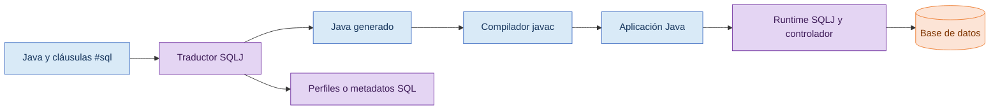
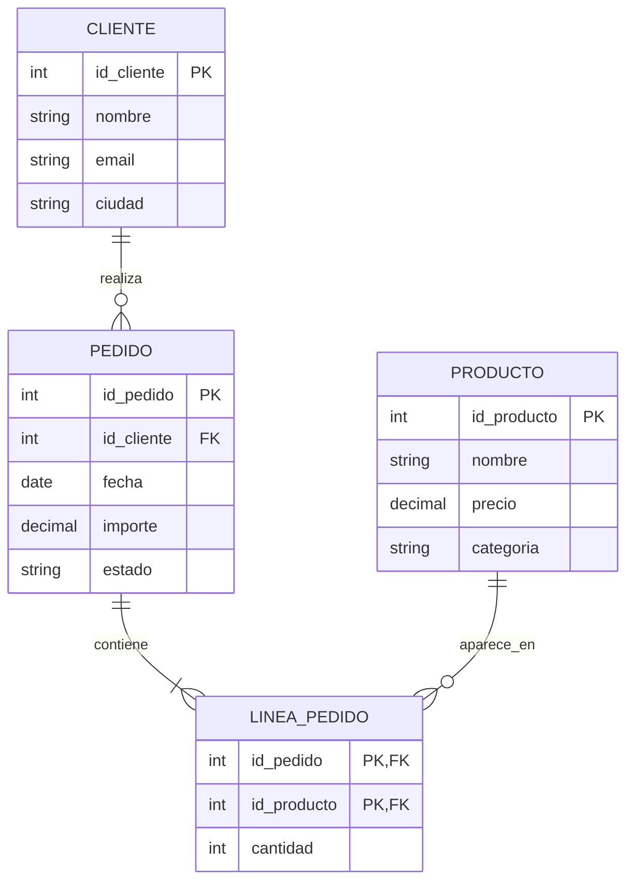

# Entrega 1. Fundamentos, arquitectura y modelo de datos

## 1. Qué es SQLJ

SQLJ permite incorporar SQL estático dentro de código Java. Una sentencia embebida se reconoce por el marcador `#sql` y se procesa antes de compilar la aplicación Java.

```java
#sql {
    SELECT nombre
    INTO :nombreCliente
    FROM CLIENTE
    WHERE id_cliente = :idCliente
};
```

El código anterior no puede compilarse directamente con `javac`. Primero debe pasar por un traductor SQLJ compatible.

## 2. Qué significa SQL estático

En SQL estático, la estructura de la sentencia se conoce durante la traducción:

- Tablas consultadas.
- Columnas utilizadas.
- Operación SQL.
- Número y posición de las variables host.

Los valores pueden cambiar durante la ejecución, pero no la estructura fundamental de la consulta.

## 3. Arquitectura



**Descripción alternativa:** el archivo fuente pasa por el traductor SQLJ, que genera Java y, según la implementación, perfiles o metadatos. Después, `javac` compila el Java generado. En ejecución intervienen el runtime SQLJ, el controlador y la base de datos.

## 4. Fases de construcción

1. Se escribe un archivo Java o SQLJ con cláusulas `#sql`.
2. El traductor localiza cada cláusula.
3. El traductor analiza la sintaxis y los tipos que pueda validar.
4. Se genera código Java y, según el proveedor, perfiles SQL.
5. El código generado se compila con Java 8.
6. La aplicación utiliza el runtime SQLJ.
7. El controlador comunica la petición a la base de datos.

## 5. SQLJ frente a otras tecnologías

| Tecnología | Característica principal | Diferencia respecto a SQLJ |
|---|---|---|
| SQL convencional | Lenguaje de consulta | No define su integración con Java |
| JDBC | API estándar de Java | Ejecuta SQL mediante objetos Java y admite SQL dinámico |
| SQL dinámico | Se construye en ejecución | SQLJ se orienta principalmente a SQL estático |
| Procedimiento almacenado | Se ejecuta dentro de la base de datos | SQLJ forma parte del código de aplicación |
| JPA o Hibernate | Mapeo objeto-relacional | SQLJ no gestiona entidades ni persistencia automática |

## 6. Modelo de datos



**Descripción alternativa:** un cliente puede realizar muchos pedidos. Un pedido contiene muchas líneas. Un producto puede aparecer en muchas líneas. `LINEA_PEDIDO` resuelve la relación de muchos a muchos entre pedidos y productos.

## 7. Ejercicio básico 1: identificar SQL estático

### Enunciado

Indica cuál de las siguientes necesidades encaja directamente con SQLJ estático:

A. Consultar un cliente por identificador.

B. Construir una consulta con un número de columnas seleccionado por el usuario.

C. Elegir dinámicamente el nombre de la tabla.

### Solución razonada

La opción A encaja directamente. La estructura es estable y solo cambia el valor del identificador.

Las opciones B y C requieren construir SQL dinámicamente. JDBC suele ser más apropiado.

## 8. Ejercicio básico 2: recorrer la arquitectura

### Enunciado

Ordena los siguientes componentes:

- Compilador Java.
- Runtime SQLJ.
- Fuente con `#sql`.
- Base de datos.
- Traductor SQLJ.
- Java generado.

### Solución

```text
Fuente con #sql
→ Traductor SQLJ
→ Java generado
→ Compilador Java
→ Runtime SQLJ
→ Base de datos
```

## 9. Puntos que dependen del proveedor

- Comando exacto del traductor.
- Formato y personalización de perfiles SQL.
- Clases concretas para el contexto.
- Asociación entre una conexión JDBC y un contexto SQLJ.
- Diagnósticos durante traducción.
- Tipos extendidos de la base de datos.
