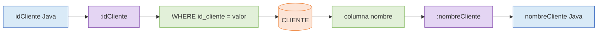

# Entrega 2. Sintaxis SQLJ y variables host

## 1. Estructura general

```java
#sql {
    sentencia SQL
};
```

Cuando la sentencia utiliza un contexto explícito:

```java
#sql [ctx] {
    sentencia SQL
};
```

La declaración y creación exacta de `ctx` depende de la implementación SQLJ.

## 2. Variables host

Una variable host conecta una expresión Java con una sentencia SQL. Dentro de `#sql`, se reconoce por el carácter `:`.



**Descripción alternativa:** `idCliente` entra desde Java mediante `:idCliente`; la consulta localiza la fila; la columna `nombre` sale hacia Java mediante `:nombreCliente`.

## 3. Entrada y salida

```java
String nombreCliente = null;
int idCliente = 10;

#sql {
    SELECT nombre
    INTO :nombreCliente
    FROM CLIENTE
    WHERE id_cliente = :idCliente
};
```

- `:idCliente` es una variable host de entrada.
- `:nombreCliente` es una variable host de salida.
- `SELECT INTO` debe devolver exactamente una fila.

## 4. Compatibilidad de tipos

| SQL | Java habitual | Consideración |
|---|---|---|
| `INTEGER` | `int` o `Integer` | `Integer` puede representar `NULL` |
| `VARCHAR` | `String` | Comprobar longitud y codificación |
| `DECIMAL` | `BigDecimal` | Evitar `double` para importes |
| `DATE` | `java.sql.Date` | La API temporal concreta depende del entorno |
| `TIMESTAMP` | `java.sql.Timestamp` | Verificar zona horaria y precisión |

## 5. Tratamiento de NULL

Un primitivo Java no puede representar `NULL`. Si una columna SQL anulable se asigna a un `int`, se puede producir un error o requerirse un mecanismo específico del proveedor.

Preferencia general:

```java
Integer cantidad = null;
BigDecimal importe = null;
String ciudad = null;
```

La forma exacta en que un traductor SQLJ admite envoltorios, indicadores de nulidad u otros mecanismos debe verificarse en su documentación.

## 6. Ejercicio básico 3: identificar entradas y salidas

### Enunciado

Analiza la siguiente cláusula:

```java
BigDecimal importe = null;
int idPedido = 200;

#sql {
    SELECT importe
    INTO :importe
    FROM PEDIDO
    WHERE id_pedido = :idPedido
};
```

### Solución

- Entrada: `:idPedido`.
- Salida: `:importe`.
- Tabla: `PEDIDO`.
- Cardinalidad esperada: una fila.
- Riesgo: `importe` puede ser `NULL`. `BigDecimal` permite representarlo.

## 7. Ejercicio básico 4: corregir una incompatibilidad

### Enunciado

```java
int email = 0;

#sql {
    SELECT email
    INTO :email
    FROM CLIENTE
    WHERE id_cliente = :idCliente
};
```

### Solución

`email` es una columna textual. La variable debe ser `String`:

```java
String email = null;
```

## 8. Ejercicio intermedio 1: dos entradas y tres salidas

### Enunciado

Recupera `id_pedido`, `fecha` e `importe` para un pedido que pertenezca a un cliente concreto.

### SQL convencional

```sql
SELECT id_pedido, fecha, importe
FROM PEDIDO
WHERE id_pedido = ?
  AND id_cliente = ?;
```

### Solución SQLJ

```java
int idPedido = 200;
int idCliente = 10;
java.sql.Date fecha = null;
BigDecimal importe = null;
int idPedidoRecuperado = 0;

#sql [ctx] {
    SELECT id_pedido, fecha, importe
    INTO :idPedidoRecuperado, :fecha, :importe
    FROM PEDIDO
    WHERE id_pedido = :idPedido
      AND id_cliente = :idCliente
};
```

### Resultado esperado

Si existe el pedido y pertenece al cliente, las tres variables reciben los valores recuperados. Si no existe, debe tratarse la condición de ninguna fila encontrada.

### Errores frecuentes

- Alterar el orden entre columnas y variables de salida.
- Usar un tipo Java incompatible.
- Suponer que `importe` nunca es `NULL`.
