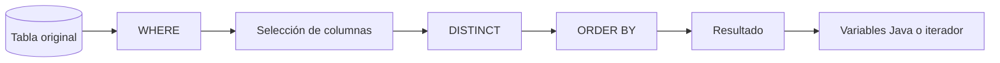
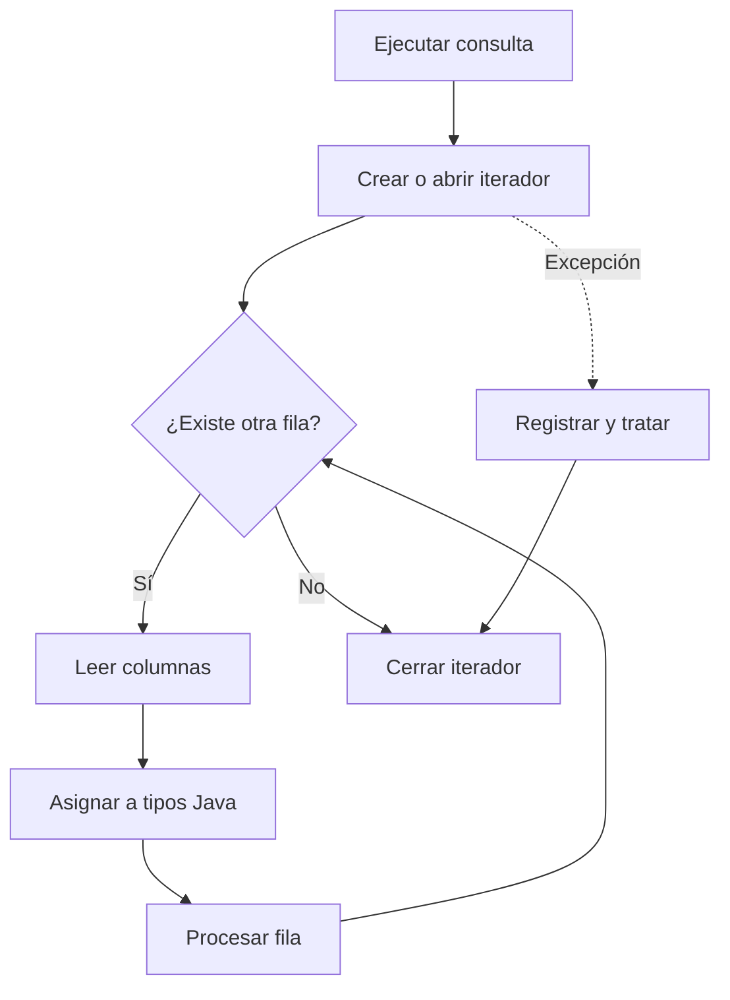

# Entrega 3. SELECT e iteradores SQLJ

## 1. Canal lógico de SELECT



**Descripción alternativa:** primero se localizan las filas, después se proyectan las columnas, se eliminan duplicados si procede, se ordena y finalmente se entrega el resultado a Java.

## 2. Una fila con SELECT INTO

### SQL convencional

```sql
SELECT nombre
FROM CLIENTE
WHERE id_cliente = ?;
```

### SQLJ

```java
String nombreCliente = null;
int idCliente = 10;

#sql [ctx] {
    SELECT nombre
    INTO :nombreCliente
    FROM CLIENTE
    WHERE id_cliente = :idCliente
};
```

### Casos posibles

| Resultado SQL | Consecuencia |
|---|---|
| Exactamente una fila | Se asigna la salida |
| Ninguna fila | Condición o excepción de no encontrado |
| Varias filas | Error de cardinalidad |
| Una fila con `NULL` | La variable debe admitir nulidad |

Las excepciones y códigos exactos pueden variar según el runtime y la base de datos.

## 3. Varias filas mediante iterador nombrado

```java
#sql iterator PedidoIterator(
    int idPedido,
    java.sql.Date fecha,
    BigDecimal importe,
    String estado
);
```

Consulta y recorrido:

```java
PedidoIterator pedidos = null;

try {
    #sql [ctx] pedidos = {
        SELECT id_pedido AS idPedido,
               fecha AS fecha,
               importe AS importe,
               estado AS estado
        FROM PEDIDO
        WHERE id_cliente = :idCliente
        ORDER BY fecha
    };

    while (pedidos.next()) {
        procesarPedido(
            pedidos.idPedido(),
            pedidos.fecha(),
            pedidos.importe(),
            pedidos.estado()
        );
    }
} finally {
    if (pedidos != null) {
        pedidos.close();
    }
}
```

Los alias, nombres de accesores y reglas exactas del iterador deben ajustarse al traductor utilizado.

## 4. Flujo del iterador



**Descripción alternativa:** el iterador se recorre fila a fila; cada vuelta comprueba si hay otra fila, lee los valores y procesa el registro. Al terminar o producirse un error, se cierra.

## 5. SELECT DISTINCT y ORDER BY

### SQL

```sql
SELECT DISTINCT ciudad
FROM CLIENTE
WHERE ciudad IS NOT NULL
ORDER BY ciudad;
```

### SQLJ

```java
#sql iterator CiudadIterator(String ciudad);

CiudadIterator ciudades = null;

try {
    #sql [ctx] ciudades = {
        SELECT DISTINCT ciudad AS ciudad
        FROM CLIENTE
        WHERE ciudad IS NOT NULL
        ORDER BY ciudad
    };

    while (ciudades.next()) {
        System.out.println(ciudades.ciudad());
    }
} finally {
    if (ciudades != null) {
        ciudades.close();
    }
}
```

## 6. Ejercicio básico 5: SELECT INTO

### Enunciado

Recupera el estado del pedido `300`.

### Solución

```java
int idPedido = 300;
String estado = null;

#sql [ctx] {
    SELECT estado
    INTO :estado
    FROM PEDIDO
    WHERE id_pedido = :idPedido
};
```

## 7. Ejercicio intermedio 2: pedidos abiertos

### Enunciado

Obtén todos los pedidos de un cliente cuyo estado sea `ABIERTO`, ordenados de mayor a menor importe.

### Solución SQL

```sql
SELECT id_pedido, fecha, importe
FROM PEDIDO
WHERE id_cliente = ?
  AND estado = 'ABIERTO'
ORDER BY importe DESC;
```

### Solución SQLJ

```java
#sql iterator PedidoAbiertoIterator(
    int idPedido,
    java.sql.Date fecha,
    BigDecimal importe
);

PedidoAbiertoIterator it = null;
String estado = "ABIERTO";

try {
    #sql [ctx] it = {
        SELECT id_pedido AS idPedido,
               fecha AS fecha,
               importe AS importe
        FROM PEDIDO
        WHERE id_cliente = :idCliente
          AND estado = :estado
        ORDER BY importe DESC
    };

    while (it.next()) {
        mostrar(it.idPedido(), it.fecha(), it.importe());
    }
} finally {
    if (it != null) {
        it.close();
    }
}
```

## 8. Ejercicio avanzado 1: paginación

### Enunciado

Diseña una consulta que recupere pedidos por páginas.

### Consideración

La sintaxis de paginación no es completamente uniforme entre motores. Algunas bases de datos admiten `OFFSET ... FETCH`, otras utilizan `LIMIT`, y sistemas heredados pueden requerir otras construcciones.

### Solución portable a nivel de diseño

1. Mantener estable el `ORDER BY` con una clave única.
2. Encapsular la sintaxis específica del motor.
3. No afirmar que una variante concreta es SQLJ estándar.
4. Si la consulta debe cambiar según el motor o los criterios son dinámicos, valorar JDBC.
