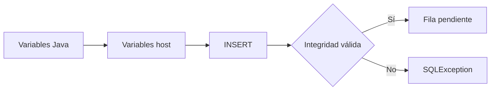
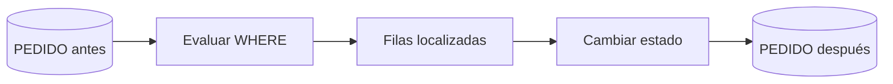
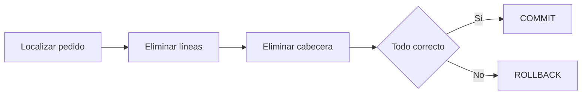

# Entrega 4. INSERT, UPDATE y DELETE

## 1. INSERT



### SQL convencional

```sql
INSERT INTO CLIENTE (
    id_cliente, nombre, email, ciudad
) VALUES (?, ?, ?, ?);
```

### SQLJ

```java
#sql [ctx] {
    INSERT INTO CLIENTE (
        id_cliente, nombre, email, ciudad
    ) VALUES (
        :idCliente, :nombre, :email, :ciudad
    )
};
```

### Errores habituales

- Clave primaria duplicada.
- Columna obligatoria sin valor.
- Longitud máxima superada.
- Tipo de dato incompatible.
- Error de conexión.

La generación automática de identificadores y su recuperación dependen del motor y de la implementación. No debe asumirse una sintaxis universal.

## 2. UPDATE

### SQL convencional

```sql
UPDATE PEDIDO
SET estado = ?
WHERE id_pedido = ?;
```

### SQLJ

```java
#sql [ctx] {
    UPDATE PEDIDO
    SET estado = :nuevoEstado
    WHERE id_pedido = :idPedido
};
```



> **Riesgo crítico:** un `UPDATE` sin `WHERE` puede modificar todos los pedidos.

## 3. DELETE

Orden lógico al eliminar un pedido con líneas:



### SQL

```sql
DELETE FROM LINEA_PEDIDO
WHERE id_pedido = ?;

DELETE FROM PEDIDO
WHERE id_pedido = ?;
```

### SQLJ

```java
#sql [ctx] {
    DELETE FROM LINEA_PEDIDO
    WHERE id_pedido = :idPedido
};

#sql [ctx] {
    DELETE FROM PEDIDO
    WHERE id_pedido = :idPedido
};
```

Ambas operaciones deben formar una sola transacción.

## 4. Ejercicio básico 6: insertar producto

### Enunciado

Inserta un producto con identificador, nombre, precio y categoría.

### Solución

```java
int idProducto = 101;
String nombre = "Teclado";
BigDecimal precio = new BigDecimal("49.95");
String categoria = "PERIFERICOS";

#sql [ctx] {
    INSERT INTO PRODUCTO (
        id_producto, nombre, precio, categoria
    ) VALUES (
        :idProducto, :nombre, :precio, :categoria
    )
};
```

## 5. Ejercicio intermedio 3: cambio controlado de estado

### Enunciado

Permite cambiar un pedido de `NUEVO` a `APROBADO`, pero no actualizar pedidos que ya estén en otro estado.

### Solución SQL

```sql
UPDATE PEDIDO
SET estado = 'APROBADO'
WHERE id_pedido = ?
  AND estado = 'NUEVO';
```

### Solución SQLJ

```java
String estadoAnterior = "NUEVO";
String estadoNuevo = "APROBADO";

#sql [ctx] {
    UPDATE PEDIDO
    SET estado = :estadoNuevo
    WHERE id_pedido = :idPedido
      AND estado = :estadoAnterior
};
```

### Consideración

Debe comprobarse si la implementación permite recuperar de forma fiable el número de filas afectadas. Si el resultado es cero, el pedido no existe o ya no estaba en `NUEVO`.

## 6. Ejercicio intermedio 4: eliminación segura

### Enunciado

Elimina un pedido y sus líneas de manera atómica.

### Solución razonada

1. Desactivar autocommit.
2. Eliminar las líneas.
3. Eliminar la cabecera.
4. Confirmar solo si ambas operaciones terminan correctamente.
5. Revertir ante cualquier error.

La implementación completa aparece en la entrega de transacciones.

## 7. Ejercicio avanzado 2: actualización optimista

### Enunciado

Evita sobrescribir un cambio realizado por otro proceso. Solo actualiza el importe si conserva el valor leído previamente.

### SQL

```sql
UPDATE PEDIDO
SET importe = ?
WHERE id_pedido = ?
  AND importe = ?;
```

### SQLJ

```java
#sql [ctx] {
    UPDATE PEDIDO
    SET importe = :importeNuevo
    WHERE id_pedido = :idPedido
      AND importe = :importeAnterior
};
```

### Interpretación

- Una fila afectada: actualización realizada.
- Cero filas: pedido inexistente o modificación concurrente.

En aplicaciones reales suele ser preferible una columna de versión, si el modelo permite añadirla.
