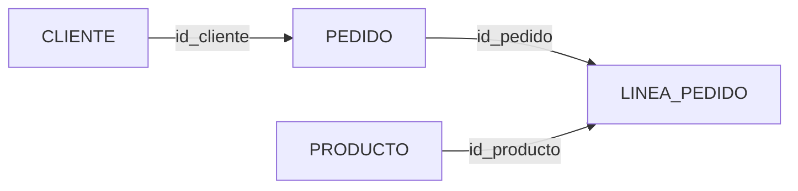

# Entrega 5. JOIN, UNION, subconsultas y agrupaciones

## 1. INNER JOIN

```sql
SELECT c.nombre, p.id_pedido, p.importe
FROM CLIENTE c
INNER JOIN PEDIDO p
    ON p.id_cliente = c.id_cliente;
```

Solo se conservan clientes que tienen pedidos y pedidos que tienen cliente coincidente.

## 2. LEFT JOIN

```sql
SELECT c.nombre, p.id_pedido, p.importe
FROM CLIENTE c
LEFT JOIN PEDIDO p
    ON p.id_cliente = c.id_cliente;
```

Conserva todos los clientes. Los clientes sin pedido reciben `NULL` en las columnas de `PEDIDO`.

### Filtro en ON

```sql
SELECT c.nombre, p.id_pedido
FROM CLIENTE c
LEFT JOIN PEDIDO p
    ON p.id_cliente = c.id_cliente
   AND p.estado = 'ABIERTO';
```

Conserva clientes sin pedidos abiertos.

### Filtro en WHERE

```sql
SELECT c.nombre, p.id_pedido
FROM CLIENTE c
LEFT JOIN PEDIDO p
    ON p.id_cliente = c.id_cliente
WHERE p.estado = 'ABIERTO';
```

El filtro descarta las filas con `p.estado = NULL`. En la práctica, el resultado puede equivaler a un `INNER JOIN` para ese criterio.

## 3. JOIN de cuatro tablas



```sql
SELECT c.nombre AS cliente,
       p.id_pedido,
       pr.nombre AS producto,
       lp.cantidad,
       pr.precio,
       lp.cantidad * pr.precio AS importe_linea
FROM CLIENTE c
JOIN PEDIDO p
    ON p.id_cliente = c.id_cliente
JOIN LINEA_PEDIDO lp
    ON lp.id_pedido = p.id_pedido
JOIN PRODUCTO pr
    ON pr.id_producto = lp.id_producto;
```

### Integración SQLJ

```java
#sql iterator DetallePedidoIterator(
    String cliente,
    int idPedido,
    String producto,
    int cantidad,
    BigDecimal precio,
    BigDecimal importeLinea
);
```

La consulta se asignaría a este iterador utilizando alias consistentes con los nombres declarados.

## 4. RIGHT, FULL OUTER y CROSS JOIN

- `RIGHT JOIN` conserva la tabla derecha. Normalmente puede reescribirse invirtiendo las tablas y usando `LEFT JOIN`.
- `FULL OUTER JOIN` conserva coincidencias y filas exclusivas de ambos lados. No todos los motores lo soportan directamente.
- `CROSS JOIN` genera el producto cartesiano. Con 1.000 clientes y 2.000 productos produciría 2.000.000 de combinaciones antes de aplicar filtros posteriores.

## 5. UNION y UNION ALL

```sql
SELECT ciudad
FROM CLIENTE
WHERE ciudad = 'Bilbao'
UNION
SELECT ciudad
FROM CLIENTE
WHERE ciudad = 'Madrid';
```

`UNION` elimina duplicados. `UNION ALL` conserva todas las apariciones.

Requisitos:

- Mismo número de columnas.
- Mismo orden lógico.
- Tipos compatibles.
- `ORDER BY`, si existe, se aplica normalmente al resultado combinado.

## 6. EXISTS y NOT EXISTS

```sql
SELECT c.id_cliente, c.nombre
FROM CLIENTE c
WHERE EXISTS (
    SELECT 1
    FROM PEDIDO p
    WHERE p.id_cliente = c.id_cliente
);
```

`EXISTS` pregunta si existe al menos una fila. No necesita recuperar todas las columnas de la subconsulta.

```sql
SELECT c.id_cliente, c.nombre
FROM CLIENTE c
WHERE NOT EXISTS (
    SELECT 1
    FROM PEDIDO p
    WHERE p.id_cliente = c.id_cliente
);
```

## 7. Riesgo de NOT IN con NULL

```sql
SELECT nombre
FROM CLIENTE
WHERE id_cliente NOT IN (
    SELECT id_cliente
    FROM PEDIDO
);
```

Si la subconsulta devuelve un `NULL`, la lógica ternaria de SQL puede impedir que la condición sea verdadera. Una alternativa más robusta suele ser `NOT EXISTS`.

## 8. GROUP BY y HAVING


```sql
SELECT c.id_cliente,
       c.nombre,
       COUNT(p.id_pedido) AS num_pedidos,
       SUM(p.importe) AS importe_total,
       AVG(p.importe) AS importe_medio,
       MIN(p.importe) AS importe_minimo,
       MAX(p.importe) AS importe_maximo
FROM CLIENTE c
LEFT JOIN PEDIDO p
    ON p.id_cliente = c.id_cliente
GROUP BY c.id_cliente, c.nombre
HAVING COUNT(p.id_pedido) >= 2
ORDER BY importe_total DESC;
```

## 9. Ejercicio intermedio 5: clientes sin pedidos

### Solución con LEFT JOIN

```sql
SELECT c.id_cliente, c.nombre
FROM CLIENTE c
LEFT JOIN PEDIDO p
    ON p.id_cliente = c.id_cliente
WHERE p.id_pedido IS NULL;
```

### Solución con NOT EXISTS

```sql
SELECT c.id_cliente, c.nombre
FROM CLIENTE c
WHERE NOT EXISTS (
    SELECT 1
    FROM PEDIDO p
    WHERE p.id_cliente = c.id_cliente
);
```

La variante con `NOT EXISTS` expresa directamente la ausencia de pedidos.

## 10. Ejercicio avanzado 3: clientes con gasto superior a la media

### Enunciado

Obtén los clientes cuyo importe total de pedidos sea superior al importe total medio por cliente.

### Solución SQL

```sql
SELECT c.id_cliente,
       c.nombre,
       SUM(p.importe) AS total_cliente
FROM CLIENTE c
JOIN PEDIDO p
    ON p.id_cliente = c.id_cliente
GROUP BY c.id_cliente, c.nombre
HAVING SUM(p.importe) > (
    SELECT AVG(t.total_cliente)
    FROM (
        SELECT SUM(p2.importe) AS total_cliente
        FROM PEDIDO p2
        GROUP BY p2.id_cliente
    ) t
);
```

### Advertencia de compatibilidad

El uso de una tabla derivada en `FROM` está ampliamente disponible, pero la sintaxis, los alias obligatorios y la validación por parte del traductor SQLJ pueden variar. Debe verificarse en el motor concreto.

## 11. Ejercicio avanzado 4: productos nunca vendidos

### Solución

```sql
SELECT pr.id_producto, pr.nombre
FROM PRODUCTO pr
WHERE NOT EXISTS (
    SELECT 1
    FROM LINEA_PEDIDO lp
    WHERE lp.id_producto = pr.id_producto
);
```

### Integración SQLJ

```java
#sql iterator ProductoIterator(
    int idProducto,
    String nombre
);

ProductoIterator productos = null;

try {
    #sql [ctx] productos = {
        SELECT pr.id_producto AS idProducto,
               pr.nombre AS nombre
        FROM PRODUCTO pr
        WHERE NOT EXISTS (
            SELECT 1
            FROM LINEA_PEDIDO lp
            WHERE lp.id_producto = pr.id_producto
        )
    };

    while (productos.next()) {
        procesarProducto(
            productos.idProducto(),
            productos.nombre()
        );
    }
} finally {
    if (productos != null) {
        productos.close();
    }
}
```
