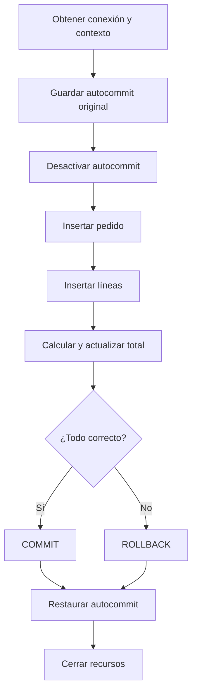
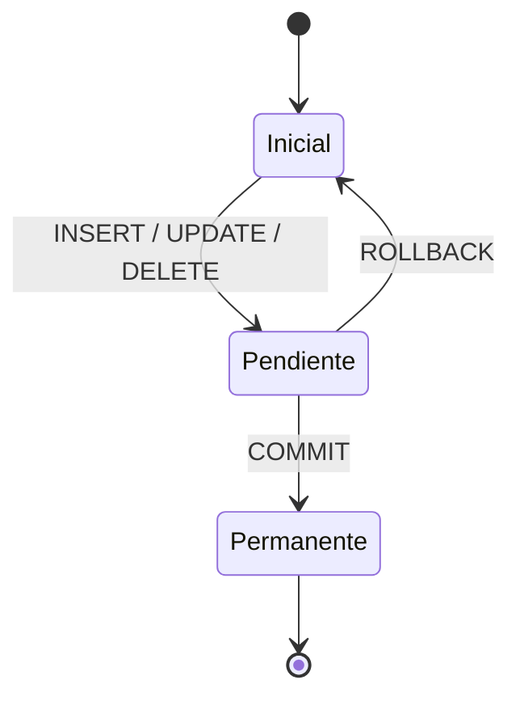

# Entrega 6. Transacciones, errores y recursos

## 1. Objetivo de una transacción

Una transacción garantiza que una operación de negocio formada por varios cambios se confirma por completo o se revierte.



## 2. Estado de los datos



## 3. Patrón Java 8

```java
boolean autocommitOriginal = connection.getAutoCommit();

try {
    connection.setAutoCommit(false);

    // Crear o asociar el contexto SQLJ según la implementación.

    #sql [ctx] {
        INSERT INTO PEDIDO (
            id_pedido, id_cliente, fecha, importe, estado
        ) VALUES (
            :idPedido, :idCliente, :fecha, :importeInicial, :estado
        )
    };

    for (LineaEntrada linea : lineas) {
        int idProducto = linea.getIdProducto();
        int cantidad = linea.getCantidad();

        #sql [ctx] {
            INSERT INTO LINEA_PEDIDO (
                id_pedido, id_producto, cantidad
            ) VALUES (
                :idPedido, :idProducto, :cantidad
            )
        };
    }

    connection.commit();
} catch (SQLException e) {
    try {
        connection.rollback();
    } catch (SQLException rollbackError) {
        e.addSuppressed(rollbackError);
    }
    throw e;
} finally {
    try {
        connection.setAutoCommit(autocommitOriginal);
    } finally {
        connection.close();
    }
}
```

> La relación exacta entre `connection` y `ctx` depende del runtime SQLJ. No debe copiarse el patrón sin adaptar la creación y liberación del contexto.

## 4. Errores y decisiones

| Error | Revertir | Reintentar | Acción principal |
|---|---:|---:|---|
| Clave primaria duplicada | Sí | No sin cambiar entrada | Corregir identificador o regla de negocio |
| Clave ajena inexistente | Sí | No sin corregir datos | Validar referencias |
| Deadlock | Sí | Posiblemente | Reintento limitado con espera |
| Timeout | Sí | Depende | Revisar carga, bloqueo e idempotencia |
| Pérdida de conexión | Intentar | Solo con idempotencia | Descartar conexión |
| Error de `COMMIT` | Estado dudoso | No de forma ciega | Consultar política y trazabilidad |
| Error de `ROLLBACK` | Ya intentado | No | Registrar como error secundario y descartar conexión |

## 5. Información que debe registrarse

- Identificador técnico de la operación.
- Tipo de operación.
- `SQLState`.
- Código de error del proveedor.
- Duración.
- Número de intento.
- Identificadores funcionales no sensibles necesarios para rastreo.

No registrar:

- Contraseñas.
- Cadenas de conexión completas con credenciales.
- Tokens.
- Datos personales innecesarios.
- SQL construido con valores sensibles incrustados.

## 6. Ejercicio intermedio 6: eliminar pedido de forma atómica

### Solución

```java
boolean auto = connection.getAutoCommit();

try {
    connection.setAutoCommit(false);

    #sql [ctx] {
        DELETE FROM LINEA_PEDIDO
        WHERE id_pedido = :idPedido
    };

    #sql [ctx] {
        DELETE FROM PEDIDO
        WHERE id_pedido = :idPedido
    };

    connection.commit();
} catch (SQLException e) {
    try {
        connection.rollback();
    } catch (SQLException rollbackError) {
        e.addSuppressed(rollbackError);
    }
    throw e;
} finally {
    try {
        connection.setAutoCommit(auto);
    } finally {
        connection.close();
    }
}
```

## 7. Ejercicio avanzado 5: política de reintentos

### Enunciado

Diseña una política para reintentar una transacción que falle por deadlock.

### Solución razonada

1. Revertir toda la transacción.
2. Cerrar o descartar recursos afectados.
3. Comprobar que la operación es idempotente o dispone de una clave de petición única.
4. Reintentar un número pequeño y configurable de veces.
5. Introducir una espera creciente y una variación aleatoria.
6. No reintentar errores permanentes como una FK inexistente.
7. Registrar cada intento sin duplicar datos sensibles.

### Pseudocódigo

```java
SQLException ultimoError = null;

for (int intento = 1; intento <= maxIntentos; intento++) {
    try {
        ejecutarTransaccionPedido();
        return;
    } catch (SQLException e) {
        ultimoError = e;

        if (!esDeadlockReintentable(e) || intento == maxIntentos) {
            throw e;
        }

        esperar(calcularEspera(intento));
    }
}

throw ultimoError;
```

`esDeadlockReintentable` debe basarse en `SQLState` y códigos documentados por el proveedor, no únicamente en el texto del mensaje.

## 8. Ejercicio avanzado 6: fallo durante COMMIT

### Enunciado

¿Qué debe hacer la aplicación si `commit()` lanza una excepción?

### Solución

No debe asumir automáticamente que la transacción se revirtió. Dependiendo del momento de la pérdida de comunicación, el servidor podría haber confirmado los cambios aunque el cliente no recibiera la respuesta.

Acciones recomendadas:

1. Registrar el identificador idempotente de la operación.
2. Descartar la conexión.
3. Consultar el resultado mediante una nueva conexión si el diseño lo permite.
4. Evitar repetir ciegamente la operación.
5. Utilizar restricciones únicas o una clave de petición para reconocer duplicados.
