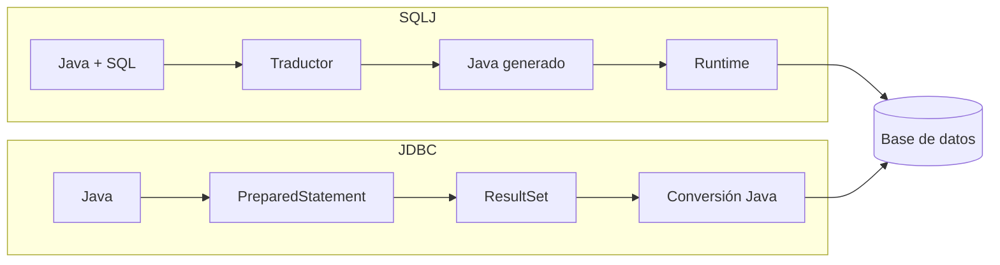

# Entrega 7. SQLJ frente a JDBC y buenas prácticas

## 1. Comparativa

| Criterio | SQLJ | JDBC |
|---|---|---|
| Modelo | SQL embebido traducido | API Java |
| SQL | Principalmente estático | Estático o dinámico |
| Parámetros | Variables host | Marcadores `?` y métodos `setXxx` |
| Resultados | `SELECT INTO` e iteradores | `ResultSet` |
| Validación temprana | Posible durante traducción | Normalmente al preparar o ejecutar |
| Flexibilidad | Menor | Mayor |
| Cadena de construcción | Traductor SQLJ y compilador | Compilador Java |
| Dependencia | Runtime y herramientas concretas | API estándar, aunque el SQL depende del motor |
| Uso habitual | Sistemas heredados con SQL estable | Desarrollo general y consultas dinámicas |

## 2. Misma consulta con SQLJ

```java
String nombre = null;

#sql [ctx] {
    SELECT nombre
    INTO :nombre
    FROM CLIENTE
    WHERE id_cliente = :idCliente
};
```

## 3. Misma consulta con JDBC

```java
String sql =
    "SELECT nombre FROM CLIENTE WHERE id_cliente = ?";

try (PreparedStatement ps = connection.prepareStatement(sql)) {
    ps.setInt(1, idCliente);

    try (ResultSet rs = ps.executeQuery()) {
        if (!rs.next()) {
            return null;
        }

        String nombre = rs.getString("nombre");

        if (rs.next()) {
            throw new SQLException("La consulta devolvió más de una fila");
        }

        return nombre;
    }
}
```

## 4. Flujo comparado



## 5. Criterios de selección

SQLJ puede resultar adecuado cuando:

- La aplicación ya utiliza SQLJ.
- Las consultas son estables.
- La cadena de construcción y el runtime están mantenidos.
- La validación temprana aporta valor.
- Migrar no compensa el riesgo o coste.

JDBC suele resultar más adecuado cuando:

- Las consultas se construyen dinámicamente.
- Se busca una API estándar ampliamente conocida.
- Se integran librerías actuales.
- Se necesita flexibilidad en tiempo de ejecución.
- Se desarrolla una aplicación nueva sin dependencia previa de SQLJ.

## 6. Buenas prácticas

### Parametrizar

Correcto:

```java
#sql [ctx] {
    SELECT nombre
    INTO :nombre
    FROM CLIENTE
    WHERE id_cliente = :idCliente
};
```

Evitar la construcción de SQL concatenando entradas. En SQLJ estático, el propio modelo favorece las variables host. Para necesidades dinámicas, debe usarse JDBC con `PreparedStatement`, no concatenación insegura.

### Recuperar solo lo necesario

```sql
SELECT nombre, email
FROM CLIENTE
WHERE id_cliente = ?;
```

Evitar:

```sql
SELECT *
FROM CLIENTE;
```

### Delimitar transacciones

- Preparar y validar datos antes de iniciar una transacción, cuando sea seguro.
- Mantener la transacción abierta el menor tiempo posible.
- No realizar esperas de usuario durante la transacción.
- Confirmar la operación de negocio completa, no fragmentos aislados.

### Proteger UPDATE y DELETE

- Revisar el `WHERE`.
- Utilizar claves o condiciones selectivas.
- Verificar filas afectadas si la API lo permite.
- Ejecutar dentro de una transacción cuando el impacto lo requiera.

## 7. Ejercicio intermedio 7: elegir tecnología

### Caso A

Un informe permite seleccionar dinámicamente 3 de 40 columnas, añadir filtros opcionales y elegir agrupaciones.

**Solución:** JDBC suele ser más adecuado, idealmente con un constructor de consultas seguro y parámetros.

### Caso B

Una aplicación heredada contiene 300 consultas SQLJ estáticas, tiene traductor soportado y recibe cambios mínimos.

**Solución:** mantener SQLJ puede ser razonable. Deben documentarse la cadena de construcción, versiones y pruebas de regresión.

### Caso C

Una nueva aplicación Java debe ejecutar cinco consultas fijas, pero el equipo no dispone de herramientas SQLJ.

**Solución:** JDBC es la opción práctica. Introducir SQLJ añadiría una dependencia de construcción sin una ventaja suficiente.

## 8. Ejercicio avanzado 7: plan de migración SQLJ a JDBC

### Solución propuesta

1. Inventariar cláusulas `#sql`, iteradores y contextos.
2. Clasificar consultas por complejidad y criticidad.
3. Crear pruebas de caracterización para resultados y errores.
4. Migrar primero consultas simples de una fila.
5. Sustituir iteradores por `ResultSet` con cierre automático.
6. Mantener idénticos límites transaccionales.
7. Comparar planes SQL y rendimiento.
8. Migrar por módulos, no mediante una sustitución global sin pruebas.
9. Eliminar el traductor y runtime solo cuando no queden dependencias.
