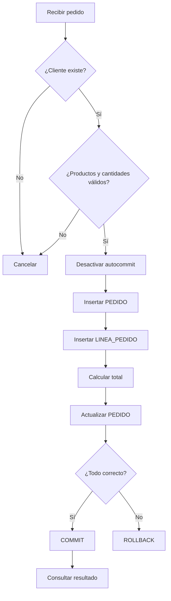

# Entrega 8. Taller de ejercicios resueltos

## Matriz de progresión

| Nivel | Ejercicio | Conceptos principales |
|---|---|---|
| Básico | B1. Buscar cliente | `SELECT INTO`, entrada y salida |
| Básico | B2. Insertar cliente | `INSERT`, tipos y restricciones |
| Básico | B3. Listar pedidos | Iterador y cierre |
| Intermedio | I1. Clientes sin pedidos | `LEFT JOIN` y `NOT EXISTS` |
| Intermedio | I2. Informe por cliente | `GROUP BY`, agregados y `HAVING` |
| Intermedio | I3. Eliminar pedido | Transacción y orden de borrado |
| Avanzado | A1. Crear pedido completo | Validaciones, DML y `COMMIT` |
| Avanzado | A2. Control de concurrencia | Actualización optimista |
| Avanzado | A3. Recuperación ante fallo | Idempotencia, reintentos y trazabilidad |

# Nivel básico

## B1. Buscar un cliente

### Enunciado

Dado `idCliente`, recuperar nombre, email y ciudad.

### SQL

```sql
SELECT nombre, email, ciudad
FROM CLIENTE
WHERE id_cliente = ?;
```

### Solución SQLJ

```java
String nombre = null;
String email = null;
String ciudad = null;

#sql [ctx] {
    SELECT nombre, email, ciudad
    INTO :nombre, :email, :ciudad
    FROM CLIENTE
    WHERE id_cliente = :idCliente
};
```

### Resultado esperado

Las tres variables contienen los datos del cliente. La ausencia de fila debe convertirse en un resultado controlado o una excepción funcional.

## B2. Insertar un cliente

### Solución

```java
int idCliente = 20;
String nombre = "Marta López";
String email = "marta@example.test";
String ciudad = "Bilbao";

#sql [ctx] {
    INSERT INTO CLIENTE (
        id_cliente, nombre, email, ciudad
    ) VALUES (
        :idCliente, :nombre, :email, :ciudad
    )
};
```

### Comprobaciones

- Identificador no duplicado.
- Nombre y email dentro de su longitud.
- Nulabilidad permitida por el esquema.
- `COMMIT` controlado por el nivel de servicio.

## B3. Listar pedidos de un cliente

### Solución

```java
#sql iterator PedidoIterator(
    int idPedido,
    java.sql.Date fecha,
    BigDecimal importe,
    String estado
);

PedidoIterator it = null;

try {
    #sql [ctx] it = {
        SELECT id_pedido AS idPedido,
               fecha AS fecha,
               importe AS importe,
               estado AS estado
        FROM PEDIDO
        WHERE id_cliente = :idCliente
        ORDER BY fecha DESC
    };

    while (it.next()) {
        procesar(
            it.idPedido(),
            it.fecha(),
            it.importe(),
            it.estado()
        );
    }
} finally {
    if (it != null) {
        it.close();
    }
}
```

# Nivel intermedio

## I1. Clientes sin pedidos

### Enunciado

Obtener clientes que nunca hayan realizado un pedido.

### Solución recomendada

```sql
SELECT c.id_cliente, c.nombre
FROM CLIENTE c
WHERE NOT EXISTS (
    SELECT 1
    FROM PEDIDO p
    WHERE p.id_cliente = c.id_cliente
);
```

### Integración SQLJ

```java
#sql iterator ClienteIterator(
    int idCliente,
    String nombre
);

ClienteIterator it = null;

try {
    #sql [ctx] it = {
        SELECT c.id_cliente AS idCliente,
               c.nombre AS nombre
        FROM CLIENTE c
        WHERE NOT EXISTS (
            SELECT 1
            FROM PEDIDO p
            WHERE p.id_cliente = c.id_cliente
        )
    };

    while (it.next()) {
        procesarCliente(it.idCliente(), it.nombre());
    }
} finally {
    if (it != null) {
        it.close();
    }
}
```

## I2. Informe agregado por cliente

### Enunciado

Mostrar clientes con al menos dos pedidos y un gasto total superior a 500 euros.

### SQL

```sql
SELECT c.id_cliente,
       c.nombre,
       COUNT(p.id_pedido) AS num_pedidos,
       SUM(p.importe) AS total,
       AVG(p.importe) AS media,
       MIN(p.importe) AS minimo,
       MAX(p.importe) AS maximo
FROM CLIENTE c
JOIN PEDIDO p
    ON p.id_cliente = c.id_cliente
GROUP BY c.id_cliente, c.nombre
HAVING COUNT(p.id_pedido) >= 2
   AND SUM(p.importe) > 500
ORDER BY total DESC;
```

### Variables host

Los límites deben parametrizarse:

```java
int minimoPedidos = 2;
BigDecimal minimoTotal = new BigDecimal("500.00");
```

La cláusula SQLJ puede utilizar `:minimoPedidos` y `:minimoTotal` dentro de `HAVING`.

## I3. Eliminar un pedido

### Solución razonada

1. Confirmar que el pedido existe.
2. Iniciar la transacción.
3. Eliminar `LINEA_PEDIDO`.
4. Eliminar `PEDIDO`.
5. Confirmar.
6. Revertir ante cualquier error.

```java
boolean auto = connection.getAutoCommit();

try {
    connection.setAutoCommit(false);

    #sql [ctx] {
        DELETE FROM LINEA_PEDIDO
        WHERE id_pedido = :idPedido
    };

    #sql [ctx] {
        DELETE FROM PEDIDO
        WHERE id_pedido = :idPedido
    };

    connection.commit();
} catch (SQLException e) {
    try {
        connection.rollback();
    } catch (SQLException rollbackError) {
        e.addSuppressed(rollbackError);
    }
    throw e;
} finally {
    try {
        connection.setAutoCommit(auto);
    } finally {
        connection.close();
    }
}
```

# Nivel avanzado

## A1. Crear un pedido completo

### Enunciado

Desarrollar una operación que:

1. Compruebe que el cliente existe.
2. Compruebe que todos los productos existen.
3. Rechace cantidades menores o iguales que cero.
4. Inserte la cabecera del pedido.
5. Inserte todas las líneas.
6. Calcule el total con `BigDecimal`.
7. Actualice el importe del pedido.
8. Ejecute `COMMIT` si todo es correcto.
9. Ejecute `ROLLBACK` ante cualquier fallo.
10. Consulte el pedido completo.

### Flujo



### Clases de entrada

```java
public final class LineaEntrada {
    private final int idProducto;
    private final int cantidad;

    public LineaEntrada(int idProducto, int cantidad) {
        this.idProducto = idProducto;
        this.cantidad = cantidad;
    }

    public int getIdProducto() {
        return idProducto;
    }

    public int getCantidad() {
        return cantidad;
    }
}
```

### Solución principal

```java
public void crearPedido(
        Connection connection,
        /* TipoContextoSQLJ */ Object ctx,
        int idPedido,
        int idCliente,
        java.sql.Date fecha,
        List<LineaEntrada> lineas) throws SQLException {

    if (lineas == null || lineas.isEmpty()) {
        throw new IllegalArgumentException("El pedido debe tener líneas");
    }

    validarCliente(ctx, idCliente);

    for (LineaEntrada linea : lineas) {
        if (linea.getCantidad() <= 0) {
            throw new IllegalArgumentException("Cantidad no válida");
        }
        validarProducto(ctx, linea.getIdProducto());
    }

    boolean autoOriginal = connection.getAutoCommit();
    BigDecimal total = BigDecimal.ZERO;
    String estado = "NUEVO";

    try {
        connection.setAutoCommit(false);

        #sql [ctx] {
            INSERT INTO PEDIDO (
                id_pedido, id_cliente, fecha, importe, estado
            ) VALUES (
                :idPedido, :idCliente, :fecha, :total, :estado
            )
        };

        for (LineaEntrada linea : lineas) {
            int idProducto = linea.getIdProducto();
            int cantidad = linea.getCantidad();
            BigDecimal precio = buscarPrecio(ctx, idProducto);

            #sql [ctx] {
                INSERT INTO LINEA_PEDIDO (
                    id_pedido, id_producto, cantidad
                ) VALUES (
                    :idPedido, :idProducto, :cantidad
                )
            };

            BigDecimal importeLinea = precio.multiply(
                BigDecimal.valueOf(cantidad)
            );
            total = total.add(importeLinea);
        }

        #sql [ctx] {
            UPDATE PEDIDO
            SET importe = :total
            WHERE id_pedido = :idPedido
        };

        connection.commit();
    } catch (SQLException e) {
        try {
            connection.rollback();
        } catch (SQLException rollbackError) {
            e.addSuppressed(rollbackError);
        }
        throw e;
    } finally {
        try {
            connection.setAutoCommit(autoOriginal);
        } finally {
            connection.close();
        }
    }
}
```

`Object ctx` es un marcador deliberado. Debe sustituirse por el tipo de contexto SQLJ de la implementación. La conexión debe estar realmente asociada al contexto usado por las cláusulas SQLJ.

### Validar cliente

```java
private void validarCliente(
        /* TipoContextoSQLJ */ Object ctx,
        int idCliente) throws SQLException {

    int idRecuperado = 0;

    #sql [ctx] {
        SELECT id_cliente
        INTO :idRecuperado
        FROM CLIENTE
        WHERE id_cliente = :idCliente
    };
}
```

### Buscar precio

```java
private BigDecimal buscarPrecio(
        /* TipoContextoSQLJ */ Object ctx,
        int idProducto) throws SQLException {

    BigDecimal precio = null;

    #sql [ctx] {
        SELECT precio
        INTO :precio
        FROM PRODUCTO
        WHERE id_producto = :idProducto
    };

    if (precio == null) {
        throw new SQLException("El producto no tiene precio");
    }

    return precio;
}
```

### Riesgos que debe tratar una implementación real

- Error de `COMMIT` con resultado incierto.
- Producto eliminado entre validación e inserción.
- Precio modificado durante la operación.
- Identificador de pedido duplicado.
- Duplicación del mismo producto en las líneas.
- Política de redondeo monetario.
- Nivel de aislamiento.
- Comprobación efectiva de filas afectadas.

## A2. Control de concurrencia

### Enunciado

Actualizar el estado solo si sigue en el estado que leyó el usuario.

### Solución

```java
String estadoLeido = "NUEVO";
String estadoNuevo = "APROBADO";

#sql [ctx] {
    UPDATE PEDIDO
    SET estado = :estadoNuevo
    WHERE id_pedido = :idPedido
      AND estado = :estadoLeido
};
```

Si no se actualiza ninguna fila, otro proceso pudo modificar el pedido. La aplicación no debería sobrescribir el cambio silenciosamente.

## A3. Idempotencia y recuperación

### Enunciado

Evitar pedidos duplicados si la aplicación pierde la conexión durante `COMMIT` y el usuario reintenta.

### Solución arquitectónica

El modelo proporcionado no contiene una clave de idempotencia. En un sistema real se recomienda añadir un identificador único de petición, por ejemplo `id_solicitud`, sujeto a una restricción única.

Flujo:

1. El cliente genera `id_solicitud`.
2. El alta la almacena junto al pedido.
3. Un reintento utiliza la misma clave.
4. Si la clave ya existe, se consulta el pedido creado.
5. No se repite la operación ciegamente.

Esta mejora exige cambiar el modelo de datos y debe presentarse como extensión, no como parte del esquema original.

# Reto final sin solución inmediata

Implementa una operación de cancelación que:

- Solo permita cancelar pedidos en estado `NUEVO` o `APROBADO`.
- Cambie el estado a `CANCELADO`.
- No elimine las líneas.
- Rechace modificaciones concurrentes.
- Registre el resultado funcional sin datos sensibles.
- Sea idempotente: cancelar dos veces debe producir un resultado controlado.

## Pista de solución

Utiliza un `UPDATE` condicionado por `id_pedido` y por el conjunto de estados permitidos. Diferencia entre:

- Pedido inexistente.
- Pedido ya cancelado.
- Pedido en un estado no cancelable.
- Conflicto concurrente.

Para distinguir los casos de forma rigurosa puede ser necesaria una consulta posterior si el número de filas afectadas es cero.
