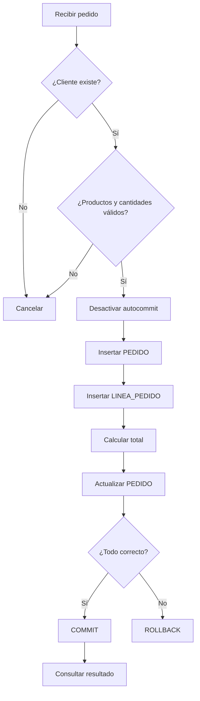
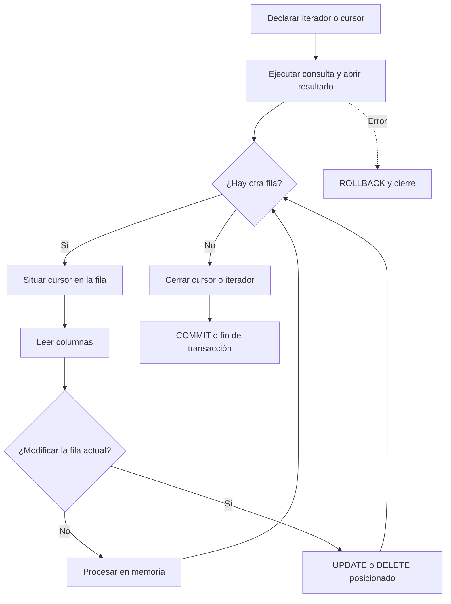

# Entrega 9. Taller de ejercicios resueltos

## Matriz de progresión

| Nivel | Ejercicio | Conceptos principales |
|---|---|---|
| Básico | B1. Buscar cliente | `SELECT INTO`, entrada y salida |
| Básico | B2. Insertar cliente | `INSERT`, tipos y restricciones |
| Básico | B3. Listar pedidos | Iterador y cierre |
| Intermedio | I1. Clientes sin pedidos | `LEFT JOIN` y `NOT EXISTS` |
| Intermedio | I2. Informe por cliente | `GROUP BY`, agregados y `HAVING` |
| Intermedio | I3. Eliminar pedido | Transacción y orden de borrado |
| Avanzado | A1. Crear pedido completo | Validaciones, DML y `COMMIT` |
| Avanzado | A2. Control de concurrencia | Actualización optimista |
| Avanzado | A3. Recuperación ante fallo | Idempotencia, reintentos y trazabilidad |

# Nivel básico

## B1. Buscar un cliente

### Enunciado

Dado `idCliente`, recuperar nombre, email y ciudad.

### SQL

```sql
SELECT nombre, email, ciudad
FROM CLIENTE
WHERE id_cliente = ?;
```

### Solución SQLJ

```java
String nombre = null;
String email = null;
String ciudad = null;

#sql [ctx] {
    SELECT nombre, email, ciudad
    INTO :nombre, :email, :ciudad
    FROM CLIENTE
    WHERE id_cliente = :idCliente
};
```

### Resultado esperado

Las tres variables contienen los datos del cliente. La ausencia de fila debe convertirse en un resultado controlado o una excepción funcional.

## B2. Insertar un cliente

### Solución

```java
int idCliente = 20;
String nombre = "Marta López";
String email = "marta@example.test";
String ciudad = "Bilbao";

#sql [ctx] {
    INSERT INTO CLIENTE (
        id_cliente, nombre, email, ciudad
    ) VALUES (
        :idCliente, :nombre, :email, :ciudad
    )
};
```

### Comprobaciones

- Identificador no duplicado.
- Nombre y email dentro de su longitud.
- Nulabilidad permitida por el esquema.
- `COMMIT` controlado por el nivel de servicio.

## B3. Listar pedidos de un cliente

### Solución

```java
#sql iterator PedidoIterator(
    int idPedido,
    java.sql.Date fecha,
    BigDecimal importe,
    String estado
);

PedidoIterator it = null;

try {
    #sql [ctx] it = {
        SELECT id_pedido AS idPedido,
               fecha AS fecha,
               importe AS importe,
               estado AS estado
        FROM PEDIDO
        WHERE id_cliente = :idCliente
        ORDER BY fecha DESC
    };

    while (it.next()) {
        procesar(
            it.idPedido(),
            it.fecha(),
            it.importe(),
            it.estado()
        );
    }
} finally {
    if (it != null) {
        it.close();
    }
}
```

# Nivel intermedio

## I1. Clientes sin pedidos

### Enunciado

Obtener clientes que nunca hayan realizado un pedido.

### Solución recomendada

```sql
SELECT c.id_cliente, c.nombre
FROM CLIENTE c
WHERE NOT EXISTS (
    SELECT 1
    FROM PEDIDO p
    WHERE p.id_cliente = c.id_cliente
);
```

### Integración SQLJ

```java
#sql iterator ClienteIterator(
    int idCliente,
    String nombre
);

ClienteIterator it = null;

try {
    #sql [ctx] it = {
        SELECT c.id_cliente AS idCliente,
               c.nombre AS nombre
        FROM CLIENTE c
        WHERE NOT EXISTS (
            SELECT 1
            FROM PEDIDO p
            WHERE p.id_cliente = c.id_cliente
        )
    };

    while (it.next()) {
        procesarCliente(it.idCliente(), it.nombre());
    }
} finally {
    if (it != null) {
        it.close();
    }
}
```

## I2. Informe agregado por cliente

### Enunciado

Mostrar clientes con al menos dos pedidos y un gasto total superior a 500 euros.

### SQL

```sql
SELECT c.id_cliente,
       c.nombre,
       COUNT(p.id_pedido) AS num_pedidos,
       SUM(p.importe) AS total,
       AVG(p.importe) AS media,
       MIN(p.importe) AS minimo,
       MAX(p.importe) AS maximo
FROM CLIENTE c
JOIN PEDIDO p
    ON p.id_cliente = c.id_cliente
GROUP BY c.id_cliente, c.nombre
HAVING COUNT(p.id_pedido) >= 2
   AND SUM(p.importe) > 500
ORDER BY total DESC;
```

### Variables host

Los límites deben parametrizarse:

```java
int minimoPedidos = 2;
BigDecimal minimoTotal = new BigDecimal("500.00");
```

La cláusula SQLJ puede utilizar `:minimoPedidos` y `:minimoTotal` dentro de `HAVING`.

## I3. Eliminar un pedido

### Solución razonada

1. Confirmar que el pedido existe.
2. Iniciar la transacción.
3. Eliminar `LINEA_PEDIDO`.
4. Eliminar `PEDIDO`.
5. Confirmar.
6. Revertir ante cualquier error.

```java
boolean auto = connection.getAutoCommit();

try {
    connection.setAutoCommit(false);

    #sql [ctx] {
        DELETE FROM LINEA_PEDIDO
        WHERE id_pedido = :idPedido
    };

    #sql [ctx] {
        DELETE FROM PEDIDO
        WHERE id_pedido = :idPedido
    };

    connection.commit();
} catch (SQLException e) {
    try {
        connection.rollback();
    } catch (SQLException rollbackError) {
        e.addSuppressed(rollbackError);
    }
    throw e;
} finally {
    try {
        connection.setAutoCommit(auto);
    } finally {
        connection.close();
    }
}
```

# Nivel avanzado

## A1. Crear un pedido completo

### Enunciado

Desarrollar una operación que:

1. Compruebe que el cliente existe.
2. Compruebe que todos los productos existen.
3. Rechace cantidades menores o iguales que cero.
4. Inserte la cabecera del pedido.
5. Inserte todas las líneas.
6. Calcule el total con `BigDecimal`.
7. Actualice el importe del pedido.
8. Ejecute `COMMIT` si todo es correcto.
9. Ejecute `ROLLBACK` ante cualquier fallo.
10. Consulte el pedido completo.

### Flujo



### Clases de entrada

```java
public final class LineaEntrada {
    private final int idProducto;
    private final int cantidad;

    public LineaEntrada(int idProducto, int cantidad) {
        this.idProducto = idProducto;
        this.cantidad = cantidad;
    }

    public int getIdProducto() {
        return idProducto;
    }

    public int getCantidad() {
        return cantidad;
    }
}
```

### Solución principal

```java
public void crearPedido(
        Connection connection,
        /* TipoContextoSQLJ */ Object ctx,
        int idPedido,
        int idCliente,
        java.sql.Date fecha,
        List<LineaEntrada> lineas) throws SQLException {

    if (lineas == null || lineas.isEmpty()) {
        throw new IllegalArgumentException("El pedido debe tener líneas");
    }

    validarCliente(ctx, idCliente);

    for (LineaEntrada linea : lineas) {
        if (linea.getCantidad() <= 0) {
            throw new IllegalArgumentException("Cantidad no válida");
        }
        validarProducto(ctx, linea.getIdProducto());
    }

    boolean autoOriginal = connection.getAutoCommit();
    BigDecimal total = BigDecimal.ZERO;
    String estado = "NUEVO";

    try {
        connection.setAutoCommit(false);

        #sql [ctx] {
            INSERT INTO PEDIDO (
                id_pedido, id_cliente, fecha, importe, estado
            ) VALUES (
                :idPedido, :idCliente, :fecha, :total, :estado
            )
        };

        for (LineaEntrada linea : lineas) {
            int idProducto = linea.getIdProducto();
            int cantidad = linea.getCantidad();
            BigDecimal precio = buscarPrecio(ctx, idProducto);

            #sql [ctx] {
                INSERT INTO LINEA_PEDIDO (
                    id_pedido, id_producto, cantidad
                ) VALUES (
                    :idPedido, :idProducto, :cantidad
                )
            };

            BigDecimal importeLinea = precio.multiply(
                BigDecimal.valueOf(cantidad)
            );
            total = total.add(importeLinea);
        }

        #sql [ctx] {
            UPDATE PEDIDO
            SET importe = :total
            WHERE id_pedido = :idPedido
        };

        connection.commit();
    } catch (SQLException e) {
        try {
            connection.rollback();
        } catch (SQLException rollbackError) {
            e.addSuppressed(rollbackError);
        }
        throw e;
    } finally {
        try {
            connection.setAutoCommit(autoOriginal);
        } finally {
            connection.close();
        }
    }
}
```

`Object ctx` es un marcador deliberado. Debe sustituirse por el tipo de contexto SQLJ de la implementación. La conexión debe estar realmente asociada al contexto usado por las cláusulas SQLJ.

### Validar cliente

```java
private void validarCliente(
        /* TipoContextoSQLJ */ Object ctx,
        int idCliente) throws SQLException {

    int idRecuperado = 0;

    #sql [ctx] {
        SELECT id_cliente
        INTO :idRecuperado
        FROM CLIENTE
        WHERE id_cliente = :idCliente
    };
}
```

### Buscar precio

```java
private BigDecimal buscarPrecio(
        /* TipoContextoSQLJ */ Object ctx,
        int idProducto) throws SQLException {

    BigDecimal precio = null;

    #sql [ctx] {
        SELECT precio
        INTO :precio
        FROM PRODUCTO
        WHERE id_producto = :idProducto
    };

    if (precio == null) {
        throw new SQLException("El producto no tiene precio");
    }

    return precio;
}
```

### Riesgos que debe tratar una implementación real

- Error de `COMMIT` con resultado incierto.
- Producto eliminado entre validación e inserción.
- Precio modificado durante la operación.
- Identificador de pedido duplicado.
- Duplicación del mismo producto en las líneas.
- Política de redondeo monetario.
- Nivel de aislamiento.
- Comprobación efectiva de filas afectadas.

## A2. Control de concurrencia

### Enunciado

Actualizar el estado solo si sigue en el estado que leyó el usuario.

### Solución

```java
String estadoLeido = "NUEVO";
String estadoNuevo = "APROBADO";

#sql [ctx] {
    UPDATE PEDIDO
    SET estado = :estadoNuevo
    WHERE id_pedido = :idPedido
      AND estado = :estadoLeido
};
```

Si no se actualiza ninguna fila, otro proceso pudo modificar el pedido. La aplicación no debería sobrescribir el cambio silenciosamente.

## A3. Idempotencia y recuperación

### Enunciado

Evitar pedidos duplicados si la aplicación pierde la conexión durante `COMMIT` y el usuario reintenta.

### Solución arquitectónica

El modelo proporcionado no contiene una clave de idempotencia. En un sistema real se recomienda añadir un identificador único de petición, por ejemplo `id_solicitud`, sujeto a una restricción única.

Flujo:

1. El cliente genera `id_solicitud`.
2. El alta la almacena junto al pedido.
3. Un reintento utiliza la misma clave.
4. Si la clave ya existe, se consulta el pedido creado.
5. No se repite la operación ciegamente.

Esta mejora exige cambiar el modelo de datos y debe presentarse como extensión, no como parte del esquema original.

# Reto final sin solución inmediata

Implementa una operación de cancelación que:

- Solo permita cancelar pedidos en estado `NUEVO` o `APROBADO`.
- Cambie el estado a `CANCELADO`.
- No elimine las líneas.
- Rechace modificaciones concurrentes.
- Registre el resultado funcional sin datos sensibles.
- Sea idempotente: cancelar dos veces debe producir un resultado controlado.

## Pista de solución

Utiliza un `UPDATE` condicionado por `id_pedido` y por el conjunto de estados permitidos. Diferencia entre:

- Pedido inexistente.
- Pedido ya cancelado.
- Pedido en un estado no cancelable.
- Conflicto concurrente.

Para distinguir los casos de forma rigurosa puede ser necesaria una consulta posterior si el número de filas afectadas es cero.

# Ampliación avanzada: cursores e iteradores posicionados

## 1. Antes de empezar: qué significa cursor en SQLJ

En SQLJ, las consultas que devuelven varias filas se procesan normalmente mediante **iteradores SQLJ**. Dependiendo de la implementación y del tipo de iterador, el resultado puede comportarse como un cursor de solo lectura o como un cursor posicionable.

Conviene distinguir:

1. **Iterador SQLJ nombrado**: expone accesores con nombres asociados a columnas.
2. **Iterador SQLJ posicional**: recupera columnas atendiendo a su posición y tipo.
3. **Cursor posicionable**: mantiene una fila actual sobre la que pueden aplicarse operaciones como `UPDATE ... WHERE CURRENT OF` o `DELETE ... WHERE CURRENT OF`, si la implementación y la base de datos lo soportan.
4. **Cursor de procedimiento almacenado**: se declara y abre dentro del lenguaje procedural del motor. No forma parte del SQLJ estándar y su sintaxis es específica del fabricante.

> **Advertencia de portabilidad**
>
> La posibilidad de nombrar el cursor, declarar sensibilidad, desplazamiento, actualización, retención después de `COMMIT` y utilizar `WHERE CURRENT OF` depende del traductor SQLJ, del runtime y de la base de datos. Los ejemplos siguientes muestran patrones conceptuales y una sintaxis habitual. Deben adaptarse y validarse con la documentación de la implementación utilizada.

## 2. Flujo general de un cursor



**Descripción alternativa:** la consulta abre un resultado, el cursor avanza fila a fila y mantiene una fila actual. La fila puede procesarse en Java o modificarse mediante una operación posicionada cuando el entorno lo permite. El cursor siempre debe cerrarse.

# Ejercicios avanzados con cursores

## C1. Recorrido mediante iterador posicional

### Nivel

Avanzado inicial.

### Enunciado

Recupera los pedidos de un cliente ordenados por fecha. Utiliza un iterador posicional y calcula en Java el total acumulado de los pedidos no cancelados.

### SQL convencional

```sql
SELECT id_pedido, fecha, importe, estado
FROM PEDIDO
WHERE id_cliente = ?
ORDER BY fecha, id_pedido;
```

### Declaración del iterador posicional

```java
#sql iterator PedidoPosicionalIterator(
    int,
    java.sql.Date,
    BigDecimal,
    String
);
```

### Solución SQLJ

```java
PedidoPosicionalIterator cursor = null;
BigDecimal totalAcumulado = BigDecimal.ZERO;

try {
    #sql [ctx] cursor = {
        SELECT id_pedido,
               fecha,
               importe,
               estado
        FROM PEDIDO
        WHERE id_cliente = :idCliente
        ORDER BY fecha, id_pedido
    };

    while (true) {
        int idPedido;
        java.sql.Date fecha;
        BigDecimal importe;
        String estado;

        #sql {
            FETCH :cursor
            INTO :idPedido, :fecha, :importe, :estado
        };

        if (!"CANCELADO".equals(estado) && importe != null) {
            totalAcumulado = totalAcumulado.add(importe);
        }

        procesarPedido(idPedido, fecha, importe, estado);
    }
} catch (SQLException e) {
    if (!esFinDeDatos(e)) {
        throw e;
    }
} finally {
    if (cursor != null) {
        cursor.close();
    }
}
```

### Explicación

En determinados estilos de iterador posicional, el avance se efectúa mediante `FETCH`. La condición de final de datos puede comunicarse mediante una excepción o estado SQL específico de la implementación.

### Punto crítico

`esFinDeDatos(e)` no debe analizar solo el texto del mensaje. Debe utilizar el `SQLState`, código o mecanismo documentado por el proveedor.

### Resultado esperado

- Todos los pedidos se procesan en orden estable.
- Los pedidos cancelados no participan en el acumulado.
- Los importes `NULL` se tratan explícitamente.
- El iterador se cierra incluso si falla una fila.

### Errores frecuentes

- Capturar cualquier `SQLException` como si indicara fin de datos.
- Cambiar el orden de las variables del `FETCH`.
- No añadir una clave única al `ORDER BY`.
- No cerrar el iterador.

---

## C2. Actualización posicionada con WHERE CURRENT OF

### Nivel

Avanzado.

### Enunciado

Recorre pedidos en estado `NUEVO`. Si el importe es superior a 1.000 euros, cambia el estado de la fila actual a `REVISAR` mediante una actualización posicionada.

### Consulta conceptual del cursor

```sql
SELECT id_pedido, importe, estado
FROM PEDIDO
WHERE estado = 'NUEVO'
FOR UPDATE OF estado;
```

### Actualización posicionada

```sql
UPDATE PEDIDO
SET estado = 'REVISAR'
WHERE CURRENT OF cursor_pedidos;
```

### Solución SQLJ orientativa

```java
#sql iterator PedidoActualizableIterator(
    int idPedido,
    BigDecimal importe,
    String estado
);

PedidoActualizableIterator cursor = null;
String estadoInicial = "NUEVO";
String estadoRevision = "REVISAR";
BigDecimal limite = new BigDecimal("1000.00");
boolean autoOriginal = connection.getAutoCommit();

try {
    connection.setAutoCommit(false);

    #sql [ctx] cursor = {
        SELECT id_pedido AS idPedido,
               importe AS importe,
               estado AS estado
        FROM PEDIDO
        WHERE estado = :estadoInicial
        FOR UPDATE OF estado
    };

    while (cursor.next()) {
        BigDecimal importe = cursor.importe();

        if (importe != null && importe.compareTo(limite) > 0) {
            #sql [ctx] {
                UPDATE PEDIDO
                SET estado = :estadoRevision
                WHERE CURRENT OF cursor_pedidos
            };
        }
    }

    connection.commit();
} catch (SQLException e) {
    try {
        connection.rollback();
    } catch (SQLException rollbackError) {
        e.addSuppressed(rollbackError);
    }
    throw e;
} finally {
    if (cursor != null) {
        cursor.close();
    }
    connection.setAutoCommit(autoOriginal);
}
```

### Dependencia específica

El identificador `cursor_pedidos` no aparece automáticamente en todas las implementaciones. Algunas requieren declarar un nombre mediante una cláusula o atributo SQLJ; otras generan o exponen el nombre de una forma distinta. También puede variar la relación entre el iterador y el cursor actualizable.

### Alternativa más portable

Cuando `WHERE CURRENT OF` no esté disponible, utilizar la clave recuperada:

```java
int idPedido = cursor.idPedido();

#sql [ctx] {
    UPDATE PEDIDO
    SET estado = :estadoRevision
    WHERE id_pedido = :idPedido
      AND estado = :estadoInicial
};
```

Esta alternativa añade control optimista mediante el estado anterior.

### Errores frecuentes

- Omitir `FOR UPDATE` cuando el motor lo exige.
- Actualizar una columna no declarada como actualizable.
- Ejecutar `COMMIT` dentro del bucle y cerrar involuntariamente el cursor.
- Mantener bloqueadas demasiadas filas durante mucho tiempo.

---

## C3. Eliminación posicionada de líneas no válidas

### Nivel

Avanzado.

### Enunciado

Recorre las líneas de un pedido y elimina la fila actual cuando `cantidad <= 0`. El ejercicio es deliberadamente correctivo. En un sistema bien diseñado, una restricción `CHECK` debería impedir esas cantidades.

### Consulta del cursor

```sql
SELECT id_pedido, id_producto, cantidad
FROM LINEA_PEDIDO
WHERE id_pedido = ?
FOR UPDATE;
```

### Eliminación posicionada

```sql
DELETE FROM LINEA_PEDIDO
WHERE CURRENT OF cursor_lineas;
```

### Solución SQLJ orientativa

```java
#sql iterator LineaActualizableIterator(
    int idPedido,
    int idProducto,
    int cantidad
);

LineaActualizableIterator cursor = null;
boolean autoOriginal = connection.getAutoCommit();

try {
    connection.setAutoCommit(false);

    #sql [ctx] cursor = {
        SELECT id_pedido AS idPedido,
               id_producto AS idProducto,
               cantidad AS cantidad
        FROM LINEA_PEDIDO
        WHERE id_pedido = :idPedidoBuscado
        FOR UPDATE
    };

    while (cursor.next()) {
        if (cursor.cantidad() <= 0) {
            #sql [ctx] {
                DELETE FROM LINEA_PEDIDO
                WHERE CURRENT OF cursor_lineas
            };
        }
    }

    connection.commit();
} catch (SQLException e) {
    try {
        connection.rollback();
    } catch (SQLException rollbackError) {
        e.addSuppressed(rollbackError);
    }
    throw e;
} finally {
    if (cursor != null) {
        cursor.close();
    }
    connection.setAutoCommit(autoOriginal);
}
```

### Alternativa por clave compuesta

```java
int idPedido = cursor.idPedido();
int idProducto = cursor.idProducto();

#sql [ctx] {
    DELETE FROM LINEA_PEDIDO
    WHERE id_pedido = :idPedido
      AND id_producto = :idProducto
      AND cantidad <= 0
};
```

### Recomendación

Añadir una restricción de base de datos equivalente a:

```sql
CHECK (cantidad > 0)
```

La sintaxis para crear o modificar la restricción puede variar según el motor y no corresponde a SQLJ, sino al DDL de la base de datos.

---

## C4. Procesamiento por lotes con cursor y puntos de control

### Nivel

Avanzado.

### Enunciado

Procesa 500.000 pedidos históricos para generar un resumen externo. El proceso debe poder reanudarse después de un error sin comenzar desde el primer pedido.

### Problema de diseño

Un cursor abierto durante toda la operación puede:

- Mantener una transacción demasiado larga.
- Retener bloqueos o versiones antiguas.
- Consumir recursos del servidor.
- Perder su posición al ejecutar `COMMIT`.

### Solución recomendada: paginación por clave

En lugar de depender de un cursor retenido durante múltiples confirmaciones, guardar la última clave procesada.

```sql
SELECT id_pedido, id_cliente, fecha, importe, estado
FROM PEDIDO
WHERE id_pedido > ?
ORDER BY id_pedido;
```

La limitación del número de filas es específica del motor. Debe encapsularse.

### Solución Java y SQLJ conceptual

```java
int ultimoIdProcesado = leerCheckpoint();
boolean terminado = false;

while (!terminado) {
    PedidoIterator cursor = null;
    int procesadosEnLote = 0;
    int ultimoIdDelLote = ultimoIdProcesado;

    try {
        #sql [ctx] cursor = {
            SELECT id_pedido AS idPedido,
                   id_cliente AS idCliente,
                   fecha AS fecha,
                   importe AS importe,
                   estado AS estado
            FROM PEDIDO
            WHERE id_pedido > :ultimoIdProcesado
            ORDER BY id_pedido
        };

        while (cursor.next() && procesadosEnLote < TAMANO_LOTE) {
            exportar(cursor);
            ultimoIdDelLote = cursor.idPedido();
            procesadosEnLote++;
        }

        if (procesadosEnLote == 0) {
            terminado = true;
        } else {
            guardarCheckpoint(ultimoIdDelLote);
            ultimoIdProcesado = ultimoIdDelLote;
        }
    } finally {
        if (cursor != null) {
            cursor.close();
        }
    }
}
```

### Mejora necesaria

La consulta anterior puede recuperar más filas de las necesarias antes de que Java detenga el bucle. En una implementación real debe utilizarse una limitación SQL compatible con el motor o un mecanismo del contexto de ejecución.

### Por qué no usar OFFSET para grandes volúmenes

La paginación por clave suele ser más estable y evita que el motor descarte progresivamente muchas filas. Además, permite reanudar el proceso guardando `ultimoIdProcesado`.

### Requisito de consistencia

Debe definirse qué ocurre con pedidos insertados o modificados mientras se ejecuta el proceso. Las opciones incluyen:

- Crear una fecha de corte.
- Procesar una fotografía consistente si el motor la soporta.
- Aceptar consistencia eventual.
- Registrar versión o fecha de modificación.

---

## C5. Cursor de detalle y agregación controlada

### Nivel

Avanzado.

### Enunciado

Recorre todas las líneas de un pedido, calcula el importe total en Java y actualiza `PEDIDO.importe`. La operación debe detectar productos inexistentes, precios `NULL` y desbordamientos lógicos.

### Consulta

```sql
SELECT lp.id_producto, lp.cantidad, pr.precio
FROM LINEA_PEDIDO lp
JOIN PRODUCTO pr
    ON pr.id_producto = lp.id_producto
WHERE lp.id_pedido = ?
ORDER BY lp.id_producto;
```

### Solución SQLJ

```java
#sql iterator CalculoLineaIterator(
    int idProducto,
    int cantidad,
    BigDecimal precio
);

CalculoLineaIterator cursor = null;
BigDecimal total = BigDecimal.ZERO;
boolean autoOriginal = connection.getAutoCommit();

try {
    connection.setAutoCommit(false);

    #sql [ctx] cursor = {
        SELECT lp.id_producto AS idProducto,
               lp.cantidad AS cantidad,
               pr.precio AS precio
        FROM LINEA_PEDIDO lp
        JOIN PRODUCTO pr
          ON pr.id_producto = lp.id_producto
        WHERE lp.id_pedido = :idPedido
        ORDER BY lp.id_producto
    };

    while (cursor.next()) {
        if (cursor.cantidad() <= 0) {
            throw new SQLException(
                "Cantidad no válida para producto " + cursor.idProducto()
            );
        }

        if (cursor.precio() == null) {
            throw new SQLException(
                "Precio nulo para producto " + cursor.idProducto()
            );
        }

        BigDecimal importeLinea = cursor.precio().multiply(
            BigDecimal.valueOf(cursor.cantidad())
        );

        total = total.add(importeLinea);
    }

    #sql [ctx] {
        UPDATE PEDIDO
        SET importe = :total
        WHERE id_pedido = :idPedido
    };

    connection.commit();
} catch (SQLException e) {
    try {
        connection.rollback();
    } catch (SQLException rollbackError) {
        e.addSuppressed(rollbackError);
    }
    throw e;
} finally {
    if (cursor != null) {
        cursor.close();
    }
    connection.setAutoCommit(autoOriginal);
}
```

### Validación adicional

El `INNER JOIN` no devuelve líneas cuyo producto no exista. Si se desea detectar explícitamente esa anomalía, utilizar `LEFT JOIN` y comprobar si las columnas de `PRODUCTO` son `NULL`.

### Variante para detectar productos inexistentes

```sql
SELECT lp.id_producto, lp.cantidad, pr.precio
FROM LINEA_PEDIDO lp
LEFT JOIN PRODUCTO pr
    ON pr.id_producto = lp.id_producto
WHERE lp.id_pedido = ?;
```

---

## C6. Dos cursores coordinados: cabecera y detalle

### Nivel

Avanzado alto.

### Enunciado

Genera un informe jerárquico de clientes y pedidos. Debe recorrer clientes con pedidos y, para cada cliente, abrir un segundo iterador con sus pedidos.

### Solución conceptual

```java
#sql iterator ClienteConPedidosIterator(
    int idCliente,
    String nombre
);

#sql iterator PedidoClienteIterator(
    int idPedido,
    java.sql.Date fecha,
    BigDecimal importe,
    String estado
);
```

```java
ClienteConPedidosIterator clientes = null;

try {
    #sql [ctx] clientes = {
        SELECT c.id_cliente AS idCliente,
               c.nombre AS nombre
        FROM CLIENTE c
        WHERE EXISTS (
            SELECT 1
            FROM PEDIDO p
            WHERE p.id_cliente = c.id_cliente
        )
        ORDER BY c.id_cliente
    };

    while (clientes.next()) {
        int idClienteActual = clientes.idCliente();
        PedidoClienteIterator pedidos = null;

        iniciarCliente(idClienteActual, clientes.nombre());

        try {
            #sql [ctx] pedidos = {
                SELECT p.id_pedido AS idPedido,
                       p.fecha AS fecha,
                       p.importe AS importe,
                       p.estado AS estado
                FROM PEDIDO p
                WHERE p.id_cliente = :idClienteActual
                ORDER BY p.fecha, p.id_pedido
            };

            while (pedidos.next()) {
                escribirPedido(
                    pedidos.idPedido(),
                    pedidos.fecha(),
                    pedidos.importe(),
                    pedidos.estado()
                );
            }
        } finally {
            if (pedidos != null) {
                pedidos.close();
            }
        }

        finalizarCliente();
    }
} finally {
    if (clientes != null) {
        clientes.close();
    }
}
```

### Riesgos

- Ejecutar una consulta por cada cliente produce el patrón N+1.
- Mantener varios cursores abiertos aumenta el consumo de recursos.
- Algunos controladores limitan resultados activos simultáneos sobre la misma conexión.

### Alternativa recomendada para volumen alto

Utilizar un único `JOIN` ordenado por cliente y pedido, y detectar en Java el cambio de cliente.

```sql
SELECT c.id_cliente,
       c.nombre,
       p.id_pedido,
       p.fecha,
       p.importe,
       p.estado
FROM CLIENTE c
JOIN PEDIDO p
    ON p.id_cliente = c.id_cliente
ORDER BY c.id_cliente, p.fecha, p.id_pedido;
```

---

## C7. Cursor con error parcial y fila de cuarentena

### Nivel

Avanzado alto.

### Enunciado

Procesa pedidos para exportarlos. Si una fila contiene un dato funcional inválido, debe registrarse en una cola de revisión y continuar. Si se produce un error de base de datos, debe detenerse el proceso.

### Solución razonada

Se deben diferenciar:

- **Error funcional de la fila**: dato incompleto o estado no exportable. Se registra y se continúa.
- **Error técnico**: pérdida de conexión, timeout o error de cursor. Se cierra y se propaga.

```java
PedidoIterator cursor = null;

try {
    #sql [ctx] cursor = {
        SELECT id_pedido AS idPedido,
               id_cliente AS idCliente,
               fecha AS fecha,
               importe AS importe,
               estado AS estado
        FROM PEDIDO
        ORDER BY id_pedido
    };

    while (cursor.next()) {
        try {
            validarFila(
                cursor.idPedido(),
                cursor.idCliente(),
                cursor.fecha(),
                cursor.importe(),
                cursor.estado()
            );

            exportarFila(cursor);
        } catch (DatoFuncionalInvalidoException e) {
            registrarEnCuarentena(
                cursor.idPedido(),
                e.getCodigoFuncional()
            );
        }
    }
} catch (SQLException e) {
    registrarErrorTecnico(e);
    throw e;
} finally {
    if (cursor != null) {
        cursor.close();
    }
}
```

### Recomendación transaccional

No mantener una transacción de base de datos abierta mientras se realiza una llamada remota lenta. Si la exportación necesita garantía de entrega, utilizar un patrón de bandeja de salida transaccional. Ese patrón requiere una tabla adicional y queda fuera del modelo original.

---

## C8. Cursor retenido después de COMMIT

### Nivel

Experto.

### Enunciado

Analiza si conviene mantener abierto un cursor después de ejecutar `COMMIT` para continuar leyendo un informe muy grande.

### Solución razonada

No existe una respuesta universal. Debe verificarse si el motor y el runtime permiten cursores retenidos, a menudo denominados *holdable cursors* o `WITH HOLD`.

Riesgos:

- Semántica distinta entre motores.
- Consumo prolongado de recursos.
- Resultado potencialmente desconectado del estado actual de los datos.
- Incompatibilidad con el iterador SQLJ utilizado.
- Comportamiento diferente ante rollback, cierre de conexión o cambio de aislamiento.

Alternativas:

1. Paginación por clave estable.
2. Exportación por lotes con punto de control.
3. Tabla temporal o fotografía preparada por el servidor.
4. Cursor retenido solo si existe una necesidad justificada y está documentado.

### Decisión recomendada

Para procesos reanudables de gran volumen, preferir paginación por clave y un checkpoint persistente. Utilizar un cursor retenido únicamente cuando la implementación lo soporte, las pruebas confirmen el comportamiento y el coste operativo sea aceptable.

# Reto experto con cursores

## Enunciado

Diseña un proceso que revise pedidos en estado `APROBADO` y realice las siguientes acciones:

1. Abra un iterador ordenado por `id_pedido`.
2. Calcule de nuevo el total de cada pedido mediante sus líneas.
3. Marque como `REVISAR` los pedidos cuyo total calculado no coincida con `PEDIDO.importe`.
4. Procese como máximo 1.000 pedidos por lote.
5. Guarde un punto de control después de cada lote confirmado.
6. Permita reanudar el proceso.
7. No mantenga dos cursores abiertos si el controlador no lo soporta.
8. Evite confirmar parcialmente la revisión de un único pedido.
9. Trate por separado errores funcionales y errores técnicos.
10. Registre información suficiente sin almacenar datos sensibles.

## Solución propuesta

### Estrategia

- Cursor exterior paginado por `id_pedido`.
- Para cada pedido, una consulta agregada calcula el total directamente en SQL.
- No es necesario abrir un segundo cursor para las líneas.
- Cada pedido constituye una pequeña unidad lógica dentro del lote.
- El lote se confirma y después se guarda el checkpoint.

### Consulta agregada

```sql
SELECT SUM(lp.cantidad * pr.precio)
FROM LINEA_PEDIDO lp
JOIN PRODUCTO pr
    ON pr.id_producto = lp.id_producto
WHERE lp.id_pedido = ?;
```

### Esqueleto SQLJ

```java
int ultimoId = leerCheckpoint();
int procesados = 0;
PedidoRevisionIterator cursor = null;
boolean autoOriginal = connection.getAutoCommit();

try {
    connection.setAutoCommit(false);

    #sql [ctx] cursor = {
        SELECT id_pedido AS idPedido,
               importe AS importe
        FROM PEDIDO
        WHERE estado = 'APROBADO'
          AND id_pedido > :ultimoId
        ORDER BY id_pedido
    };

    while (cursor.next() && procesados < 1000) {
        int idPedido = cursor.idPedido();
        BigDecimal importeGuardado = cursor.importe();
        BigDecimal importeCalculado = null;

        #sql [ctx] {
            SELECT SUM(lp.cantidad * pr.precio)
            INTO :importeCalculado
            FROM LINEA_PEDIDO lp
            JOIN PRODUCTO pr
              ON pr.id_producto = lp.id_producto
            WHERE lp.id_pedido = :idPedido
        };

        if (importeCalculado == null) {
            importeCalculado = BigDecimal.ZERO;
        }

        if (importeGuardado == null
                || importeGuardado.compareTo(importeCalculado) != 0) {

            String estadoRevision = "REVISAR";
            String estadoEsperado = "APROBADO";

            #sql [ctx] {
                UPDATE PEDIDO
                SET estado = :estadoRevision
                WHERE id_pedido = :idPedido
                  AND estado = :estadoEsperado
            };
        }

        ultimoId = idPedido;
        procesados++;
    }

    connection.commit();
    guardarCheckpoint(ultimoId);
} catch (SQLException e) {
    try {
        connection.rollback();
    } catch (SQLException rollbackError) {
        e.addSuppressed(rollbackError);
    }
    throw e;
} finally {
    if (cursor != null) {
        cursor.close();
    }
    connection.setAutoCommit(autoOriginal);
}
```

### Limitación importante

Guardar el checkpoint después del `COMMIT` deja una pequeña ventana: la transacción puede confirmarse y fallar el guardado del checkpoint. Al reanudar, algunos pedidos se revisarán de nuevo. El proceso debe ser idempotente, como ocurre en este diseño porque volver a marcar `REVISAR` mediante una condición sobre el estado no duplica datos.

Si el checkpoint debe ser estrictamente atómico con los cambios, debe almacenarse en la misma base de datos y dentro de la misma transacción, lo que requiere una tabla adicional.

